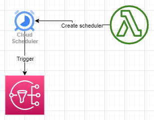

[](https://opensource.org/licenses/Apache-2.0)

<!-- PROJECT LOGO -->
<br />
<div align="center">
    

<h3 align="center">AWS Scheduler service</h3>

  <p align="center">
    AWS recently released a new general-purpose scheduling service. The following repo demonstrates how to use it, by creating reminders sent via email.
    <br />
    <br />
    <a href="https://github.com/aws-hebrew-book/reminders/issues">Report Bug</a>
    ·
    <a href="https://github.com/aws-hebrew-book/reminders/issues">Request Feature</a>
  </p>
</div>


<!-- TABLE OF CONTENTS -->
<details>
  <summary>Table of Contents</summary>
  <ol>
    <li>
      <a href="#high-level-architecture">High level architecture</a>
    </li>
    <li>
      <a href="#getting-started">Getting Started</a>
      <ul>
        <li><a href="#prerequisites">Prerequisites</a></li>
        <li><a href="#installation">Installation</a></li>
        <li><a href="#testing">Testing</a></li>
      </ul>
    </li>
    <li><a href="#contributing">Contributing</a></li>
    <li><a href="#license">License</a></li>
    <li><a href="#contact">Contact</a></li>
    <li><a href="#logo">Logo</a></li>
  </ol>
</details>


## High level architecture

<div align="center">
    
</div>

1. Use a single Lambda to create a schedule.
2. On the desginated time, the scheduler pushes a message into SNS
3. Which in turn sends an email.


## Getting started
### Prerequisites
* Make sure your machine is ready to work with [AWS SAM](https://aws.amazon.com/serverless/sam/)

### Installation
* Clone this repository.
* Run `sam build` and then `sam deploy --guided`. Accept the default values, except for 
    * _Parameter Email - Send a reminder to this email. 


### Testing
* You can test the application manully by executing the `RemindMeFunction` Lambda directly from the console. It accepts a json with the following structure:
```
{
  "content": "Hello my friend",
  "when": "2022-11-12T23:20",
  "timezone": "Asia/Bangkok"
}
```

## Contributing

Contributions are what make the open source community such an amazing place to learn, inspire, and create. Any contributions you make are **greatly appreciated**.

If you have a suggestion that would make this better, please fork the repo and create a pull request. You can also simply open an issue with the tag "enhancement".
Don't forget to give the project a star! Thanks again!

1. Fork the Project
2. Create your Feature Branch (`git checkout -b feature/AmazingFeature`)
3. Commit your Changes (`git commit -m 'Add some AmazingFeature'`)
4. Push to the Branch (`git push origin feature/AmazingFeature`)
5. Open a Pull Request


<!-- LICENSE -->
## License

Distributed under the Apache License Version 2.0 License. See `LICENSE` for more information.

<!-- CONTACT -->
## Contact

Efi Merdler-Kravitz - [@TServerless](https://twitter.com/TServerless)


## Logo
The project's logo was created by Dall-E 2 with the following description _A hand drawn sketch of a sticky note floating on a cloud_


<p align="right">(<a href="#readme-top">back to top</a>)</p>
